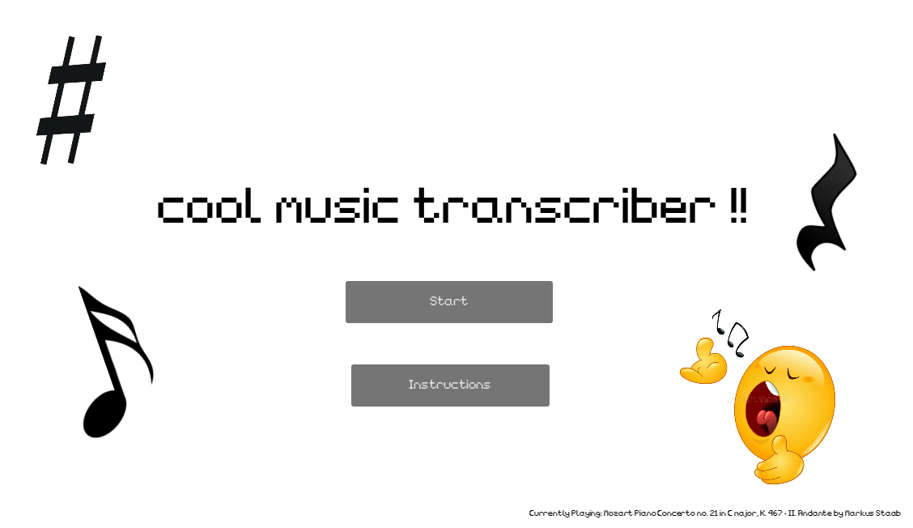
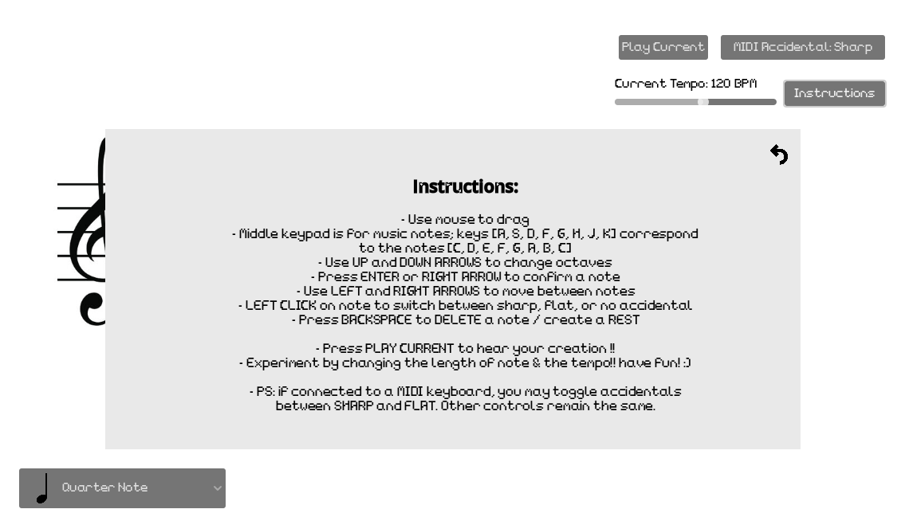
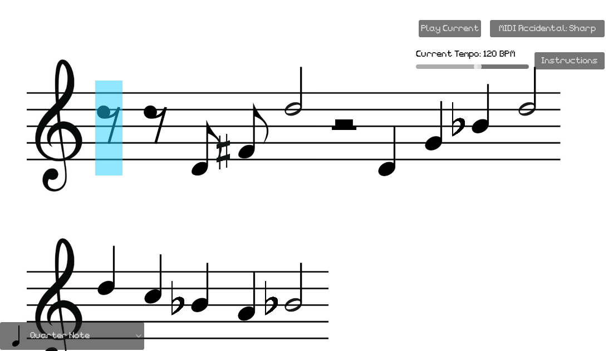

# Welcome to stxrrymuffin's ✨*cool music notation app*✨!:D
This project allows you to write down the music of your dreams; well, mostly.
If you are a music nerd, you are limited to treble clef & quarter/half/eighth/sixteenth notes, *BUT* you 
can still change the octave you are in using up & down arrow keys, delete notes with backspace to make rests, add accidentals, and switch up the tempo!

If you aren't a music nerd, I really encourage you to just play around by relying on your hearing! Try to make the melody of Twinkle Twinkle 
or come up with your own awesome tune! 💃

Check out more detailed instructions when you run the game!

^guess what this ends up playing (answer: part of howl's moving castle !)

Link to itch: https://stxrrymuffin.itch.io/music-notation-app

## Why I made this project
I made this project as part of a long-term game I'm working on to gameify music transcription & music theory (both
things I really want to improve upon myself :')). Therefore, I needed to first make some sort of music notation device in order
to be able to actually transcribe music and showcase some music theory concepts! So, that's why this initial project exists.

I also really wanted to design a game that could incorporate a MIDI keyboard as an input, so this
project also served as my first step in seeing how Godot handles MIDI inputs. Obviously, most players will only
have a normal keyboard, so all of the functions still work without a MIDI!

## How I made this project
I made this project in chunks: I started off first by adding in the initial key to note mapping -- 
when you press a key, the corresponding note should appear on the screen in the right place.
Once I got that working correctly, I implemented other key aspects, such as being able to change the octave in which you play
a note as well as the type of note (does it have accidentals? how long should the note play?).
Next, I implemented some QoL functions, so you can switch between notes without having to delete all of them -- naturally, at the same time,
I added in rest nodes so that the notes wouldn't just disappear when deleted.
Finally, I revamped some of the assets so the project wouldn't look so ugly:(, added in fonts, and included in-game instructions!

## Struggles & what I learned
Some things I struggled with were expanding on my project each time I needed to add a more complicated component. It often resulted in me
having to rework a lot of how I was storing information on each note. For example, I initially just had a list of notes and their corresponding nodes,
but as soon as I added in ledger lines, I suddenly needed lists of lists to store everything properly.
In general, I learned a lot about how to work in Godot 4, which I honestly haven't had too much experience with yet.
Also, since I've been working on and off on this project for about two months, I've realized that it's really important to leave comments on my code
(even then, it still takes some time to figure things out)!
