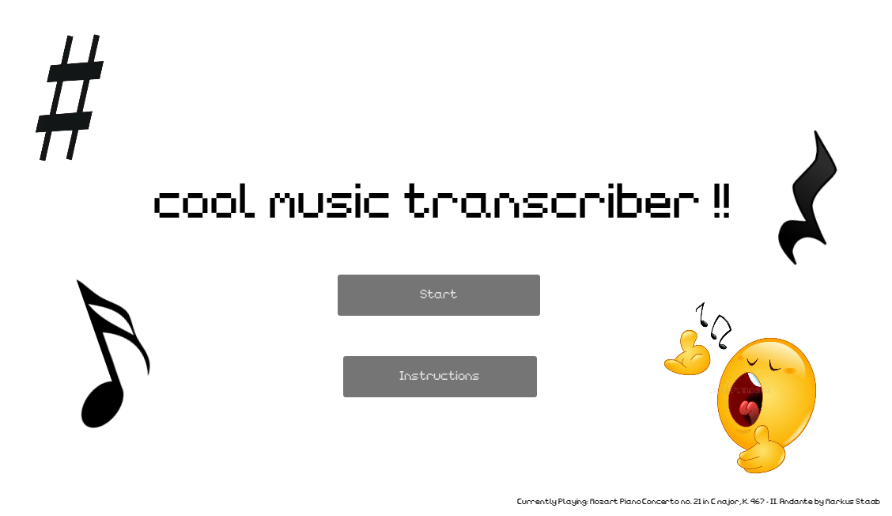
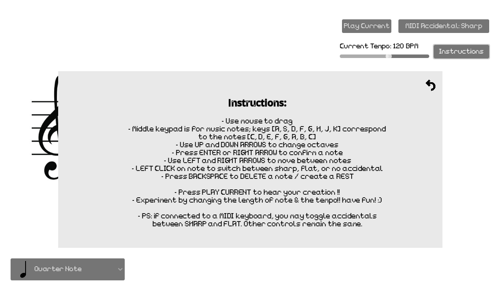
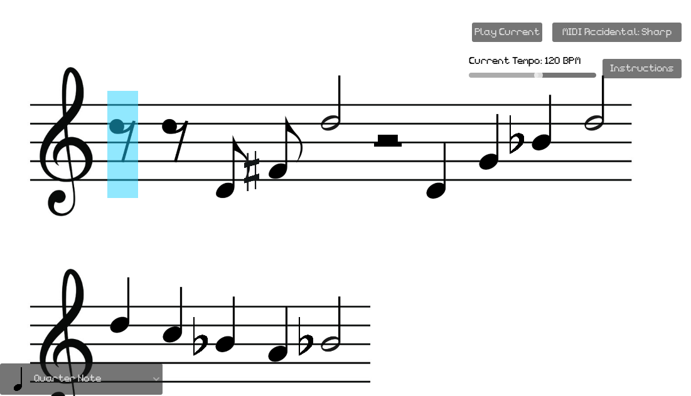

# ✨*cool music notation app*✨!:D

This project allows you to write down the music of your dreams; well, mostly.
If you are a music nerd, you are limited to treble clef & quarter/half/eighth/sixteenth notes, *BUT* you 
can still change the octave you are in, delete notes to make rests, add in accidentals, and switch up the tempo!

If you aren't a music nerd, I really encourage you to just play around by relying on your hearing! Try to make the melody of Twinkle Twinkle 
or come up with your own awesome tune! 💃

Check out more detailed instructions when you run the game!

^guess what this ends up playing (answer: part of howl's moving castle !)

Link to itch: https://stxrrymuffin.itch.io/music-notation-app
