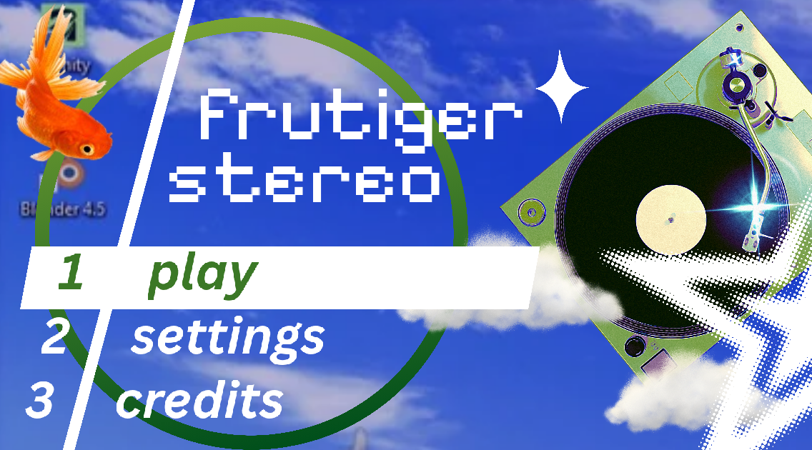
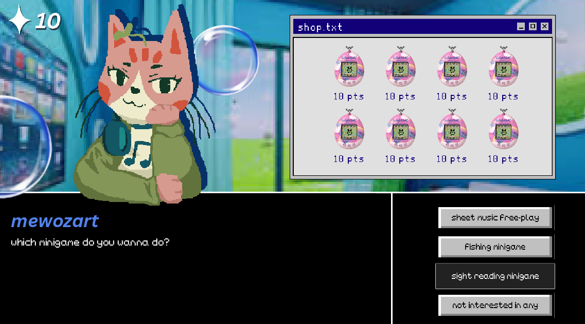
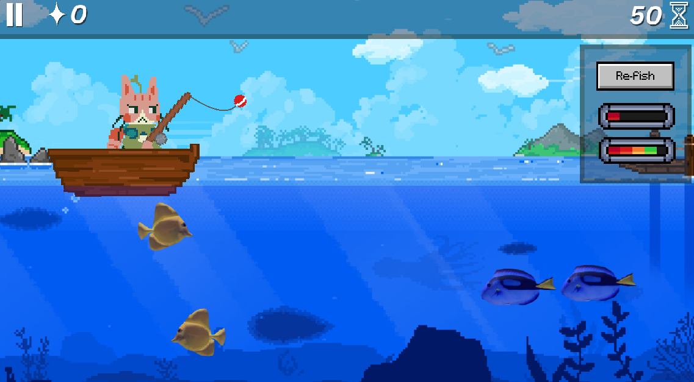
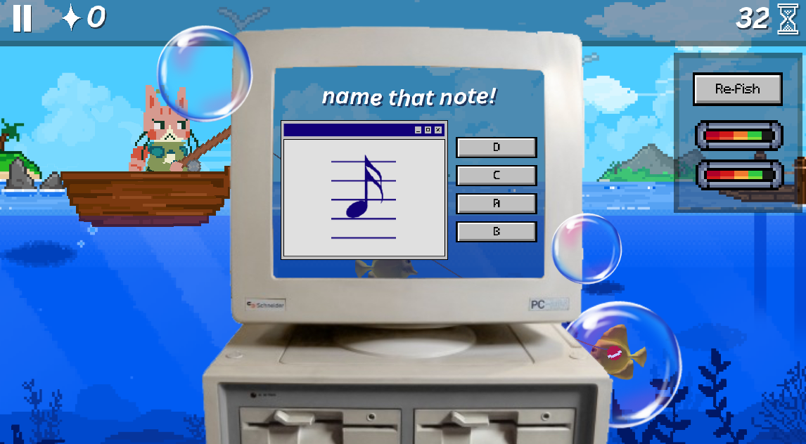
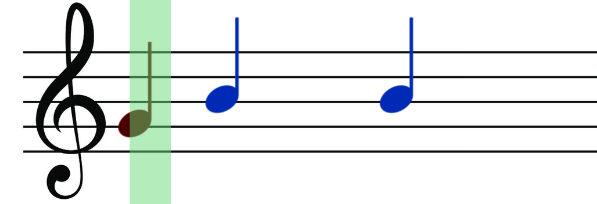

# ✨*frutiger stereo*✨!:D

*overall game is still WIP! play the music transcription (outdated) demo!

wanna learn music theory, and *have fun* while doing it?? try out frutiger stereo!

  

play educational minigames and win points to redeem cool prizes in the shop!

  

try out the following: 
1) transcription free-mode: start with an empty score & add a variety of notes/rhythms to create your own song! 
2) fishing minigame: catch fish that summon an MCQ to test your theory knowledge on the spot! 
3) sight-reading minigame: select a song and improve your note and rhythm recognition skills! 

  
  
  

# transcription demo info:
This project allows you to write down the music of your dreams; well, mostly.
If you are a music nerd, you are limited to treble clef & quarter/half/eighth/sixteenth notes, *BUT* you 
can still change the octave you are in, delete notes to make rests, add in accidentals, and switch up the tempo!

If you aren't a music nerd, I really encourage you to just play around by relying on your hearing! Try to make the melody of Twinkle Twinkle 
or come up with your own awesome tune! 💃

Check out more detailed instructions when you run the game!

^guess what this ends up playing (answer: part of howl's moving castle !)

Link to itch: https://stxrrymuffin.itch.io/music-notation-app
